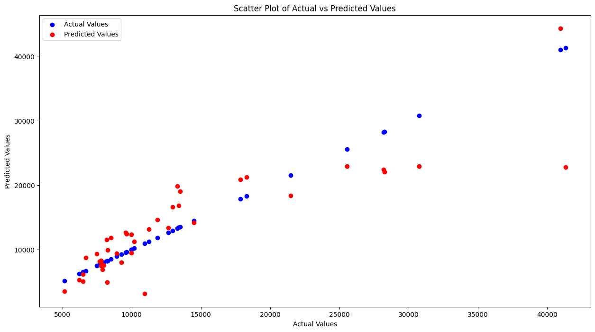
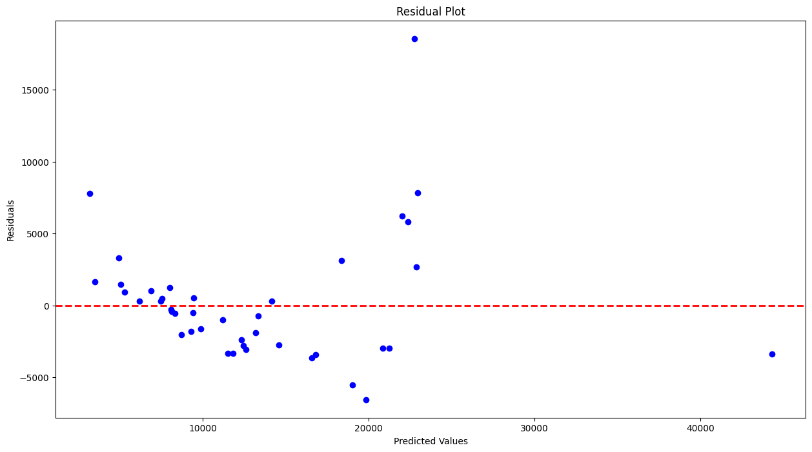

# Geely Auto Price Prediction

## Project Overview

This repository contains the code and documentation for a machine learning project that aims to predict the prices of cars for the Chinese automobile company Geely Auto in the US market. The goal is to help the company understand the factors influencing car prices in the American market and use this knowledge to make informed decisions regarding design, business strategy, and pricing dynamics.

## Problem Statement

Geely Auto wants to establish a manufacturing unit in the US and produce cars locally to compete with US and European counterparts. The company has hired an automobile consulting firm to identify significant variables affecting car prices in the American market. The consulting firm aims to answer the following questions:

- Which variables are significant in predicting the price of a car?
- How well do these variables describe the price of a car?

## Business Goal

The primary business goal is to model car prices based on available independent variables. This model will be a valuable tool for Geely Auto's management to:

- Understand how prices vary with independent variables.
- Manipulate car design, business strategy, and other factors to meet specific price levels.
- Gain insights into the pricing dynamics of a new market.

## Dataset

The dataset used in this project is sourced from [Kaggle](https://www.kaggle.com/datasets/hellbuoy/car-price-prediction). It consists of 205 samples and 25 features, including information such as car company, engine type, price, and more.

## Model Evaluation and Analysis

After training the linear regression model, I conducted an evaluation to assess its predictive performance. Here are the key findings:

### Predictive Metrics

The model exhibits a reasonable performance, with the following key metrics:

- **Root Mean Square Error (RMSE):** 4336.0186
- **R-squared Score:** 0.7618

These metrics collectively indicate that the model explains a substantial portion of the variance in the target variable, providing confidence in its predictive capabilities.

### Visualizations

To gain deeper insights, I generated visualizations to complement the quantitative metrics. The scatter plot comparing predicted vs actual values showcases the model's ability to capture trends in the data. Additionally, the residual plot indicates that the model's errors are normally distributed, validating the assumptions of linear regression.

### Validation Set Performance

The model's robustness is confirmed through its performance on the validation set:

- **Mean RMSE:** 4450.1752
- **Standard Deviation of RMSE:** 1242.9568

Consistency across multiple validation runs suggests the model's stability and generalizability.

### Areas for Improvement

While the current model demonstrates strong predictive capabilities, continuous improvement is essential. Identified areas for enhancement include:

1. **Feature Engineering:** Explore additional features or transformations to capture more nuanced patterns in the data.
2. **Hyperparameter Tuning:** Fine-tune model parameters to optimize predictive accuracy.
3. **Exploration of Alternative Models:** Consider experimenting with different algorithms to identify potential performance gains.

## Notebook

Explore the details of the machine learning model in the Jupyter notebook:

- [Geely Auto Price Prediction Model](/car.ipynb)

## Conclusion

In conclusion, the linear regression model provides a solid foundation for understanding and predicting car prices for Geely Auto in the US market. The combined analysis of quantitative metrics, visualizations, and consistency in validation set performance provides a comprehensive picture of the model's strengths and areas for improvement. Future iterations will focus on implementing refinements and leveraging insights to drive business strategies effectively.

## Disclaimer

This project is solely for educational and learning purposes. The machine learning model and insights generated are not intended for commercial use, and the results should be interpreted with caution. The accuracy and reliability of the model may be limited.

The dataset used in this project is sourced from [https://www.kaggle.com/datasets/hellbuoy/car-price-prediction] and is subject to the terms of use specified by the dataset provider.
